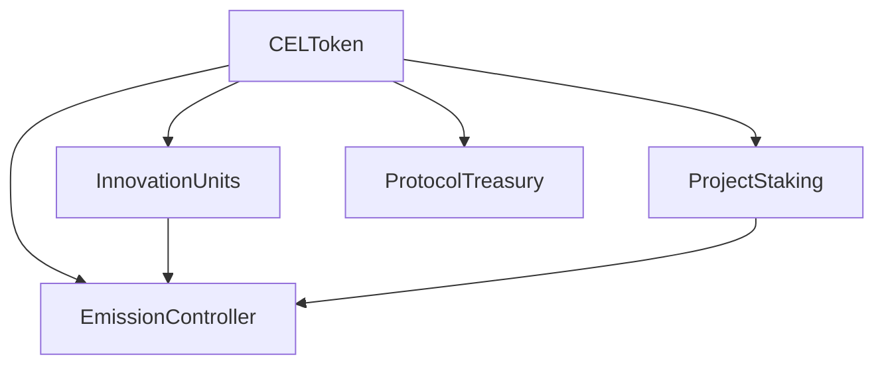

To do
Op test net deployemnt
frontend integration scripts

# Celystik Hub Smart Contracts

This repository contains the smart contracts for the Celystik Hub platform, a decentralized ecosystem for managing Innovation Units (IUs), project staking, and emissions distribution.

## Overview

The Celystik Hub platform consists of several interconnected smart contracts:

- **CELToken**: The platform's native ERC20 token
- **InnovationUnits**: ERC1155 token representing project-specific Innovation Units
- **ProjectStaking**: Handles staking mechanics and score calculations
- **EmissionController**: Manages emission distribution and rewards
- **ProtocolTreasury**: Manages protocol fees and treasury operations

## Contract Architecture



## Key Features

- **Innovation Units (IUs)**
  - Project-specific ERC1155 tokens
  - Configurable allocations for creators, contributors, and investors
  - Built-in buy/sell mechanics with fee structure
  - Liquidity management system

- **Project Staking**
  - Flexible staking periods
  - Score-based staking rewards
  - Lock period enforcement
  - Unstaking mechanism

- **Emission Control**
  - Epoch-based emission distribution
  - Dynamic reward calculation based on project metrics
  - Separate emission pools for stakers and IU holders
  - Claim verification system

## Installation

```bash
# Clone the repository
git clone https://github.com/celystik-labs/celystikhub-solidity-contracts.git

# Install dependencies
npm install
```

## Development Setup

1. Create a `.env` file with required environment variables:
```env
PRIVATE_KEY=your_private_key
INFURA_API_KEY=your_infura_key
ETHERSCAN_API_KEY=your_etherscan_key
POLYGONSCAN_API_KEY=your_polygonscan_key
OPTIMISM_API_KEY=your_optimism_key
ARBISCAN_API_KEY=your_arbiscan_key
```

2. Compile contracts:
```bash
npm run compile
```

3. Run tests:
```bash
npm test
```

4. Check test coverage:
```bash
npx hardhat coverage
```

## Test Coverage

Current test coverage metrics:
- Statements: 79.89%
- Branches: 49.50%
- Functions: 76.04%
- Lines: 80.69%

## Deployment

Deploy to various networks using:
```bash
npm run deploy -- --network <network_name>
```

Supported networks:
- Local: hardhat, localhost
- Ethereum: mainnet, goerli, sepolia
- Layer 2: polygon, polygonMumbai, optimism, arbitrum

## Contract Interactions

### Creating a Project

```javascript
const totalSupply = ethers.utils.parseEther("1000000"); // 1M total supply
const initialPrice = ethers.utils.parseEther("0.01"); // 0.01 CEL initial price
const creators = [creator1.address, creator2.address];
const creatorShares = [7000, 3000]; // 70% to creator1, 30% to creator2
const creatorAllocation = 5000;    // 50% to creators
const contributorAllocation = 3000; // 30% to contributors
const investorAllocation = 2000;    // 20% to investors

await innovationUnits.createProject(
    totalSupply,
    initialPrice,
    creators,
    creatorShares,
    creatorAllocation,
    contributorAllocation,
    investorAllocation
);
```

### Buying Innovation Units

```javascript
// Calculate costs including fees
const [basePayment, fee, totalCost] = await innovationUnits.calculateBuyingCost(projectId, amount);

// Approve CEL tokens
await celToken.approve(innovationUnits.address, totalCost);

// Buy IUs
await innovationUnits.buyIUs(projectId, amount);
```

### Staking on Projects

```javascript
const stakeAmount = ethers.utils.parseEther("1000");
const lockDurationDays = 20;

// Approve CEL tokens
await celToken.approve(projectStaking.address, stakeAmount);

// Stake on project
await projectStaking.stake(projectId, stakeAmount, lockDurationDays);
```

## Security

- All contracts use OpenZeppelin's secure implementations
- Reentrancy protection on critical functions
- Access control for privileged operations
- Emergency functions for risk mitigation
- Fee limits and input validation

## License

MIT License. See [LICENSE](LICENSE) for details.

## Contributing

1. Fork the repository
2. Create a new branch
3. Make your changes
4. Submit a pull request

## Audits

[To be completed after security audit] 